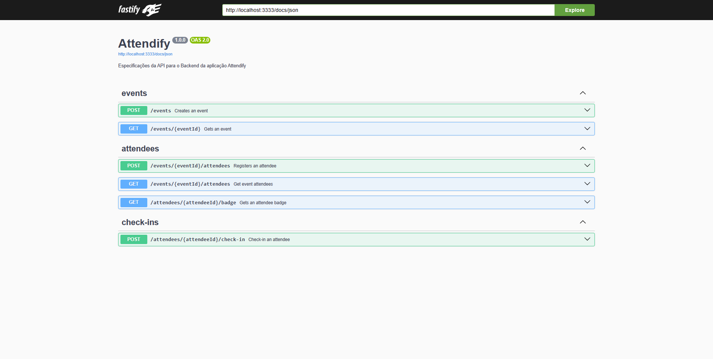

# Attendify API Rest

> ### Aplicação back-end para a gestão de participantes em eventos presenciais.


- [Descrição](#descricao)
- [Rotas da API](#rotas-da-api)
- [Como executar o projeto?](#como-executar-o-projeto)
- [Requisitos](#Requisitos-dependências)
- [Instalação das dependências](#instalacao)
- [Desenvolvedores](#desenvolvedores)

# Descrição

A aplicação tem como intuito servir como uma maneira de gerenciar participantes e eventos presenciais, podendo cadastrar um evento, cadastrar um participante, e também permitir que o participante realize check-in.

# Rotas da API

> ### As rotas são acessadas através do https://localhost:3333/nome-da-rota



Você pode ver detalhes de todas as rotas, bem como modelos de corpo das requisições, acessando o Swagger UI.

## Eventos

| Métodos |       Rotas       |     Descrição     |
| ------- | :---------------: | :---------------: |
| POST    |      /events      |  Cria um evento   |
| GET     | /events/{eventId} | Retorna um evento |

Modelo do corpo da requisição:

```
{
  "title": "string",
  "details": "string",
  "maximumAttendees": 1
}

Resposta padrão:

{
    eventId*	string($uuid)
}
```

## Attendees

| Métodos |             Rotas             |            Descrição            |
| ------- | :---------------------------: | :-----------------------------: |
| POST    |  /events/{eventId}/attendees  |      Registra participante      |
| GET     | /attendees/{attendeeId}/badge | Retorna a badge do participante |
| GET     |  /events/{eventId}/attendees  |    Retorna os participantes     |

Modelo do corpo da requisição:

```
{
  "name": "string",
  "email": "user@example.com"
}

Resposta padrão:

{
    attendeeId*	number
}
```

## Check-ins

| Métodos |              Rotas               |          Descrição           |
| ------- | :------------------------------: | :--------------------------: |
| POST    | /attendees/{attendeeId}/check-in | Faz check-in do participante |

Modelo do corpo da requisição:

```
{
    attendeeId: string($uuid)
}

Resposta padrão:
"null"
```

# Como ver todas as rotas detalhadamente?

Execute os passos abaixos para clonar o projeto, e após executar `npm run dev`, acesse:
[Swagger](http://localhost:3333/docs/static/index.html#/)

# Como executar o projeto?

## 1.0 Requisitos para rodar localmente 💻

Ferramentas **necessárias** para executar a API localmente:

<!--ts-->

- [VsCode](https://code.visualstudio.com/download) ou outro editor de preferência
- [Node.js](https://nodejs.org/en/download/) instalado na máquina
- [Postman](https://www.postman.com/downloads/), [Insomnia](https://insomnia.rest/download) ou semelhante.
<!--te-->

### 1.1 Instalando as dependências 🛠️

#### 1.1.1 Clone este repositório _localmente_ em sua máquina

```
git clone https://github.com/feapolina/attendify-api.git
```

### 1.1.2 Entre na pasta do projeto

```
cd api-server/
```

#### 1.1.3 Execute o seguinte comando para instalar as dependências do projeto:

```
npm install
```

#### 1.1.4 Execute o seguinte script para rodar o servidor:

```
npm run dev
```

#### 1.1.5 Abra o Postman e execute a rotas especificadas 💻👌

## Desenvolvedores(as) 👨‍💻

- @feapolina
